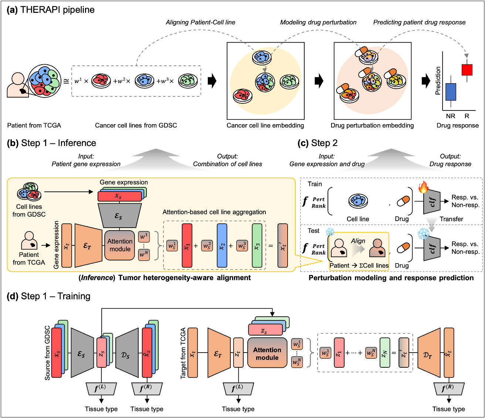

# THERAPI

THERAPI (Tumor Heterogeneity-aware Embedding for Response Adaptation and Patient Inference) is a deep learning framework that bridges the domain gap between preclinical and clinical data by modeling tumor heterogeneity and transferring gene-level drug-induced perturbation signatures to predict patient-specific drug responses.

## Model description

The full model architecture is provided below. THERAPI consists of two steps;

Step 1. Cell line-Patient Alignment

Step 2. Drug response prediction



## Setup
First, clone this repository and move to the directory.

```
git clone https://github.com/Sunginyoung/THERAPI.git
cd THERAPI/
```

## Contact
If you have any questions or concerns, please send an email to [inyoung.sung@snu.ac.kr](inyoung.sung@snu.ac.kr).
