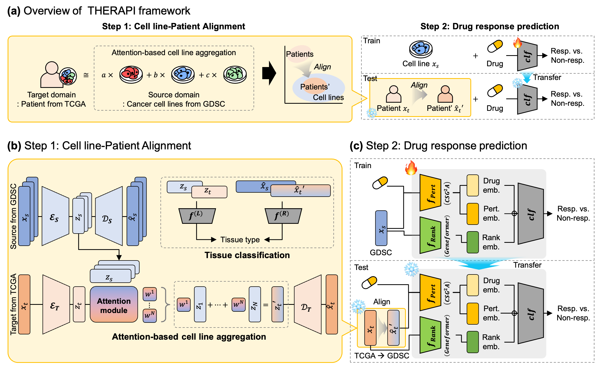

# THERAPI

THERAPI (Tumor Heterogeneity-aware Embedding for Response Adaptation and Patient Inference) is a deep learning framework that bridges the domain gap between preclinical and clinical data by modeling tumor heterogeneity and transferring gene-level drug-induced perturbation signatures to predict patient-specific drug responses.

## Model description

The full model architecture is provided below. THERAPI consists of two steps;

Step 1. Alignment of patient tumors with cancer cell lines (Figure b and d)

Step 2. Modeling perturbation and predicting drug response (Figure c)



## Setup
First, clone this repository and move to the directory.
```
git clone https://github.com/Sunginyoung/THERAPI.git
```

To install the appropriate environment for THERAPI, create a virtual environment and install the requirements befor running the code.
```
conda create -n [ENVIRONMENT NAME] python==3.9
conda activate [ENVIRONMENT NAME]
pip install -r requirements.txt
```

## Running THERAPI
#### 1. Download the dataset
```
cd THERAPI
mkdir data
cd data
```
Download the dataset used for the model from [Google Drive](https://drive.google.com/drive/folders/1rnYXYwwqwfqS-q50D68EnYjkUUfw2an2?usp=drive_link) to the `THERAPI/data` folder. After downloading the dataset, the folder structure under `THERAPI/data` should look as follows:
```
THERAPI/data/
├── GDSC/
│   ├── GDSC_split/
│   ├── GDSC_gex.csv
│   ├── GDSC_info.csv
│   ├── GDSC_Drug_SMILES_Response.csv
│   ├── GDSC_perturbation_float16.npy
│   ├── GDSC_perturbation_compound_float16.npy
│   └── GDSC_rankrepresentation.csv
│
├── TCGA/
│   ├── TCGA_unlabeled_gex.csv
│   ├── TCGA_unlabeled_info.csv
│   ├── TCGA_labeled_gex.csv
│   ├── TCGA_labeled_info.csv
│   ├── TCGA_Drug_SMILES_Response.csv
│   ├── TCGA_perturbation_float16.npy
│   ├── TCGA_perturbation_compound_float16.npy
│   ├── TCGA_rankrepresentation.csv
│   └── TCGA_Survival_info.csv
│
└── External/
    ├── External_unlabeled_gex.csv
    ├── External_unlabeled_info.csv
    ├── External_labeled_gex.csv
    └── External_labeled_info.csv
```
For detailed descriptions of each file, please refer to the `README.txt` file inside the `data/` directory.

#### 2. Training aligner
```
cd ../src
python train_aligner.py
```
Running the code above aligns the source domain data (cancer cell line data from GDSC) with the target domain data (patient tumor data from TCGA). The trained alignment model is saved in the `ckpts` folder.

To perform tissue-specific alignment, you can use the newly added script `train_aligner_tissue_specific.py`. This version enables alignment between specific tissue subsets across datasets. For example, to align GDSC cell-line data with External breast cancer patient data, run:
```
python train_aligner_tissue_specific.py --source GDSC --target External --tissue breast
```
The resulting model will be saved in the same `ckpts` directory, under a subfolder named after the specified tissue type.

#### 3. Training drug response predictor
```
python train_predictor.py
```
Running the above command trains the drug response prediction model using source-domain data (GDSC cancer cell lines) under a 10-fold cross-validation setting.
Trained models are saved in the `ckpts/` directory.

In addition to the alignment embeddings generated by THERAPI, the drug response predictor incorporates gene-level embeddings derived from two publicly available pre-trained models:

* CSG2A (Bang et al., 2024): Embeddings were obtained from *Step 1: Pretraining of condition-specific response on the LINCS L1000 dataset* ([https://github.com/eugenebang/CSG2A](https://github.com/eugenebang/CSG2A)).

* Geneformer (Theodoris et al., 2023): Embeddings were derived from the *Genecorpus-30M* pretraining ([https://github.com/jkobject/geneformer](https://github.com/jkobject/geneformer)).

The precomputed embedding matrices used in this study are provided in the `data/` directory of this repository to ensure reproducibility.


#### 4. Predicting patient drug response
```
python test_TCGA.py
```
Running the above code predicts the drug response of the target domain data (patient tumor data from TCGA).
The predicted value is stored in the `output` folder.

## Visualization

The `visualizations/` folder contains Jupyter notebooks for reproducing the main figures presented in the manuscript.  
These scripts visualize the alignment and survival analysis results corresponding to Figure 2, Figure 4, and Figure 5 of the paper.
```
THERAPI/visualizations/
├── TCGA_ID_order.txt
├── alignment_results_external.ipynb
├── alignment_results_tcga.ipynb
├── main_figure2.ipynb
├── main_figure4(a).ipynb
└── main_figure5(b).ipynb
```

## Contact
If you have any questions or concerns, please send an email to [inyoung.sung@snu.ac.kr](inyoung.sung@snu.ac.kr).
